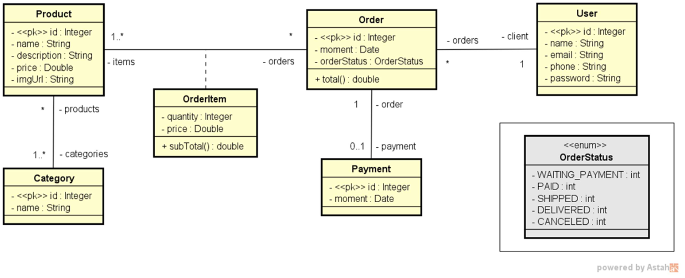

# Web Service

Web Service project developed with the following characteristics:

- Java-based Spring Framework module Spring Boot
- Java Persistence API (JPA) implemented through Hibernate
- Maven project manager
- Test profile with H2 databank
- Deployment to PostgreSQL database managed by Heroku cloud platform

### DomainModel

